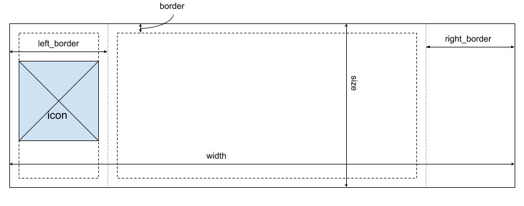
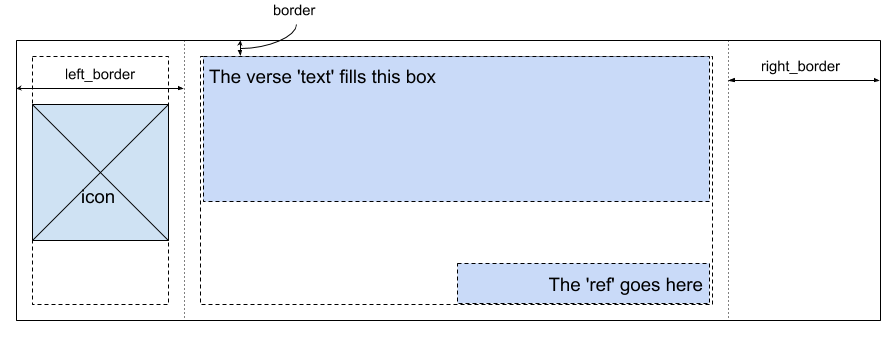
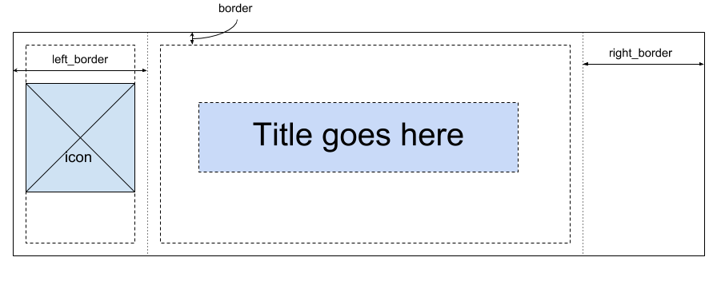

# mp-livestream-imagegen #

Generates lower-third images for overlaying the video of our church
services.

## usage ##

`$ mp-livestream-imagegen slides.toml`

The command reads a TOML formatted configuration file and generates a
series of PNG images in an `output` subdirectory.

## Configuration ##

All of the information for the slides are contained in a `slides.toml`
file passed on the command line. This file is formatted as a [TOML
document](https://github.com/toml-lang/toml).

The first section of the document contains the setup information that
is used to configure the slides.

For example:

    [setup]
    width = 1920
    height = 1080
    size = 270
    background = 'MiraclesLowerMain.png'
    border = 40
    left_border = 350
    right_border = 200
    icon = 'MiraclesLowerIMAGE.png'
    font = '../GENERAL-GRAPHICS/verdana.ttf'
	font_color = 'white'
    verse_size = 40
    title_size = 90

The fields:

* *width & height*: The dimensions of the video.
* *size*: the height of the lower-third box
* *background*: A pathname to an image file that will be used as the
  background for the lower-third. If the image is smaller than
  `width`x`size` then the image is replicated to fill the region
* *border*: distances from the edge of the lower-third to any text of
  pictures.
* *left_border* & *right_border*: Size on the left an right half of
  the lower-third that will not be used for content. Both of these can
  be omitted or set to zero if no size needs to be reserved. Usually
  these are used because the background image contains graphics that
  shouldn't be overwritten.
* *icon*: A pathname to an image file that will be inserted in the
  region defined by the *left_border* config. The image will be scaled
  to keep the same aspect ratio and be as large as possible while
  keeping a *border* blank spot around it. The image will also be
  centered.
* *font*: a pahtname to a TrueType font file used for render text in
  slides.
* *font_color*: color of text
* *verse_size*: size of text on verse slides (see below)
* *title_size*: size of text on title slides (see below)

Some of these configuation variables are shown on the following
diagram.

After the `[setup]` block in the config file there are a series of
`[[slide]]` blocks that define the different slides that should be
created.

### Verse slides ###

These are slides for displaying a bible verse. It contains two
parts. The text of the actual verse and the reference where the verse
is found in the bible. An example:

    [[slide]]
    text = '“Go,” said Jesus, “your faith has healed you.” Immediately he received his sight and followed Jesus along the road.'
    ref = 'Mark 10:52 (NIV)'

The *text* field is written in the center region of the slide starting
in the upper-left after leaving space for the *border*. The string is
word-wrapped using the full width and as many lines as needed.

The *ref* field is written in a single line right-justified in the
lower right corner.

### Title slides ###

These slide are for highlighting a main point in a sermon series and
contain a single line of text in a larger font size centered on the
screen. The slide looks like this:

    [[slide]]
	title = 'Documentation is hard'

And is rendered like this:

